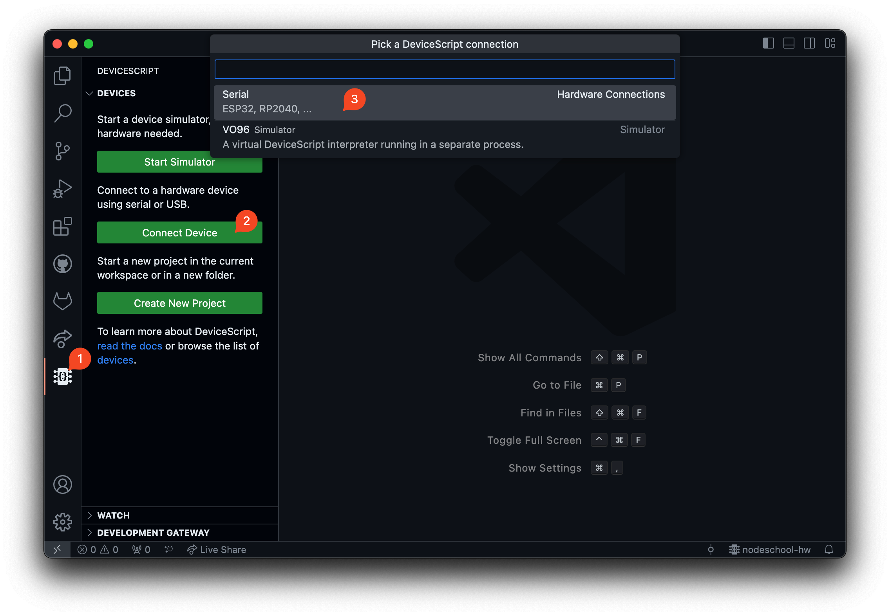
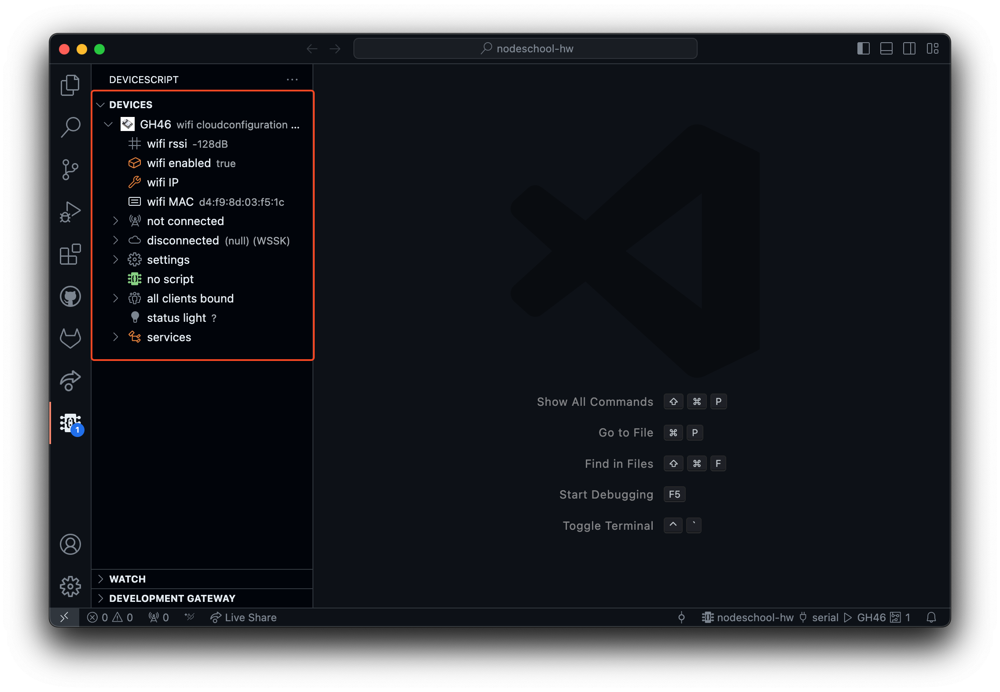
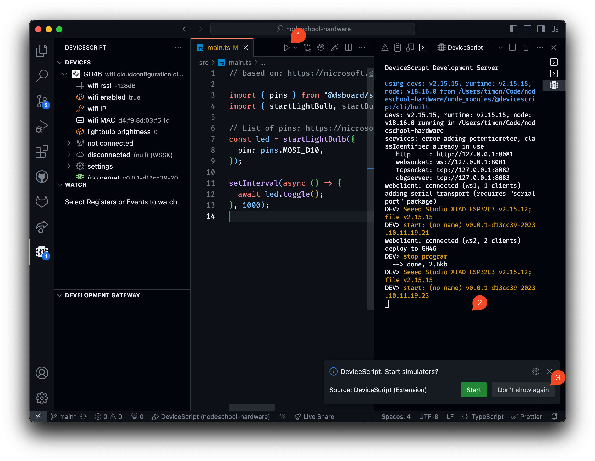
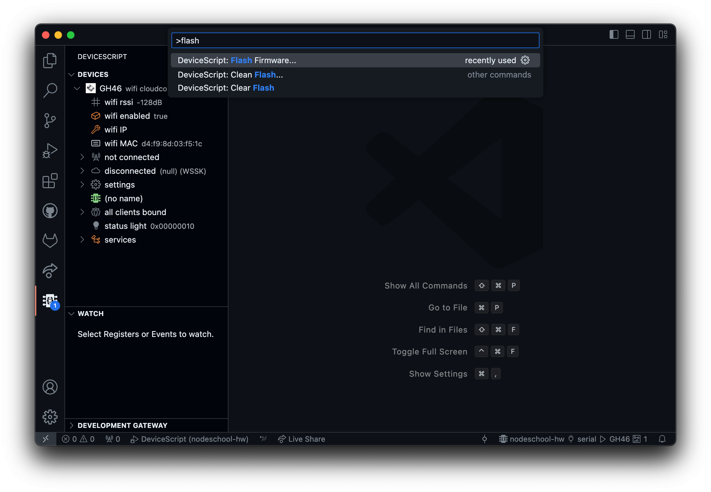
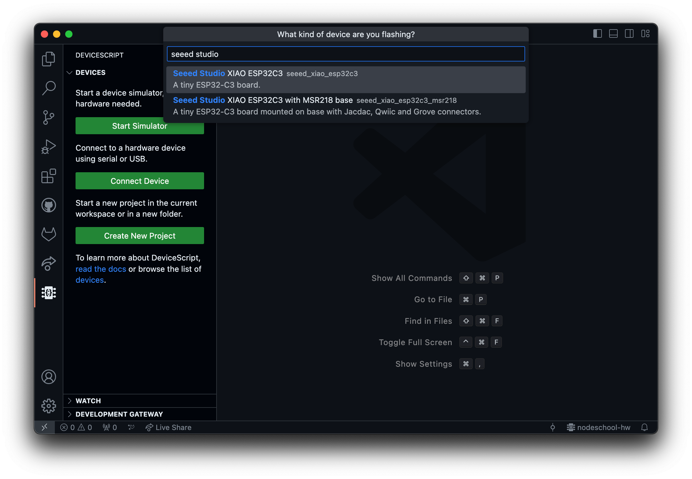
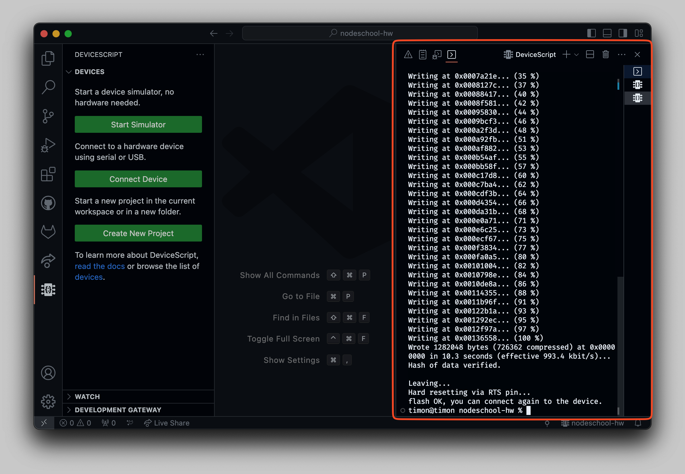

# NodeSchool Rotterdam - JavaScript × Hardware workshop

## Prerequisites

- Microcontroller: Seeed Studio XIAO ESP32C3
- Components: breadboard, wires, LEDs, buttons, and PIM board
- USB-C cable to connect microcontroller to your computer
- A computer
- Basic JavaScript knowledge (!!!TODO: link to learn)

## Getting started

1. [Install Node.js](https://nodejs.org/en/download) (v18 recommended, check by running `node -v` in your terminal)
2. Install [Visual Studio Code](https://code.visualstudio.com)
3. Install [DeviceScript](https://marketplace.visualstudio.com/items?itemName=devicescript.devicescript-vscode) extension for Visual Studio Code
4. Clone or download this project
   - Download: https://github.com/pixelbar/nodeschool-hardware/archive/refs/heads/main.zip
   - Clone: `git clone https://github.com/pixelbar/nodeschool-ai.git`
5. Open the cloned directory in Visual Studio Code
6. Install dependencies
   - Run in terminal: `npm install`

## Connecting the microcontroller to your computer

1. Connect the microcontroller to your computer using a USB-C cable
2. Open Visual Studio Code, make sure you have the DeviceScript extension installed
3. Open the DeviceScript panel (1)
4. Click on "Connect Device" (2)
5. A prompt will appear, select "Serial" (3)
6. The device should now appear in the panel

## Run code

To run your code on the microcontroller, first follow the connection steps above, then open `src/main.ts` and press the run button in the upper-right corner.

1. Follow the steps for connecting the microcontroller above.
2. Open `src/main.ts`
3. Press the run button in the upper-right corner (1)*
4. A panel should appear on the bottom or right side of the screen (2). The panel shows the output of your code (e.g., any `console.log`s in your code).
5. VS Code may prompt to start the DeviceScript simulator. You can press "Don't show again". If you're interested in simulation, learn more [here](https://microsoft.github.io/devicescript/developer/simulation).

## Flashing the microcontroller

The microcontroller comes pre-flashed with the DeviceScript firmware. An update to DeviceScript might require you to re-flash the microcontroller.

1. Connect the microcontroller to your computer using a USB-C cable
2. Open the [Command Palette](https://code.visualstudio.com/docs/getstarted/userinterface#_command-palette) (`Command+Shift+P` on Mac, `Ctrl+Shift+P` on Windows and Linux) and enter "flash".

3. Select `DeviceScript: Flash Firmware...`
4. You'll be prompted to select a device, search for "seeed studio" and select `Seeed Studio XIAO ESP32C3`

5. A command prompt should appear on the bottom or the side of your editor, wait until it says "flash OK". You can now reconnect to the device.

If you're experiencing any problems you can try to clean the flash, follow steps 1 and 2, and select `DeviceScript: Clean Flash...`.
