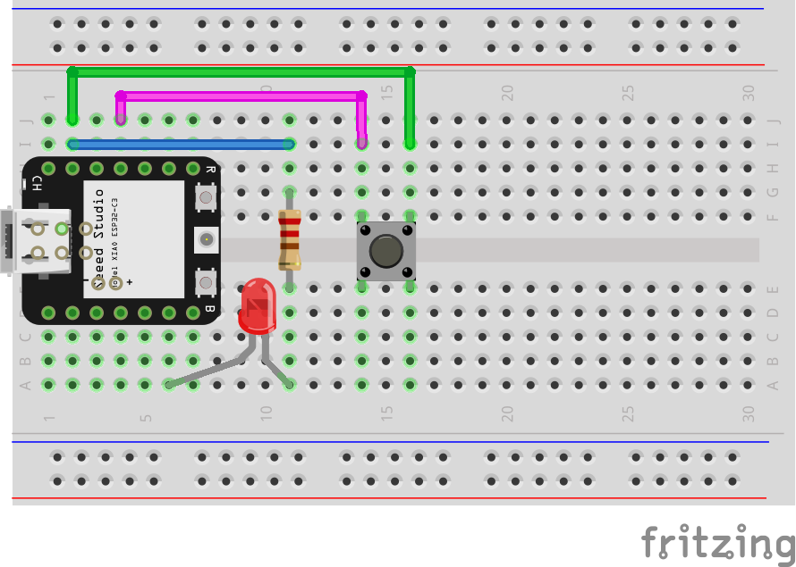

# NodeSchool Rotterdam

_This information is for the workshop given on Oct. 31st at [Pixelbar](https://pixelbar.nl), The Netherlands._

[👀 Prerequisites](#rerequisites) •
[📚 Getting started](#getting-started) •
[⚡️ Connecting the microcontroller to your computer](#rerequisites) •
[👨‍💻 Run code](#rerequisites)

## 👀 Prerequisites

- Microcontroller: Seeed Studio XIAO ESP32C3
- Components: breadboard, wires, LEDs, buttons, and PIM board
- USB-C cable to connect microcontroller to your computer
- A computer
- Basic JavaScript knowledge: [JS for cats](http://jsforcats.com/)

## 📚 Getting started

1. [Install Node.js](https://nodejs.org/en/download) (v18 recommended, check by running `node -v` in your terminal)
2. Install [Visual Studio Code](https://code.visualstudio.com)
3. Install [DeviceScript](https://marketplace.visualstudio.com/items?itemName=devicescript.devicescript-vscode) extension for Visual Studio Code
4. Clone or download this project
   - Download: https://github.com/pixelbar/nodeschool-hardware/archive/refs/heads/main.zip
   - Clone: `git clone https://github.com/pixelbar/nodeschool-ai.git`
5. Open the cloned directory in Visual Studio Code
6. Install dependencies
   - Run in terminal: `npm install`

## 🚀 Connecting the microcontroller to your computer

1. Connect the microcontroller to your computer using a USB-C cable
2. Open Visual Studio Code, make sure you have the DeviceScript extension installed
3. Open the DeviceScript panel (1)
4. Click on "Connect Device" (2)
5. A prompt will appear, select "Serial" (3)
6. The device should now appear in the panel

## 👨‍💻 Run code

To run your code on the microcontroller, first follow the connection steps above, then open `src/main.ts` and press the run button in the upper-right corner.

1. Follow the steps for connecting the microcontroller above.
2. Open `src/main.ts`
3. Press the run button in the upper-right corner (1)
4. A panel should appear on the bottom or right side of the screen (2). The panel shows the output of your code (e.g., any `console.log`s in your code).
5. VS Code may prompt to start the DeviceScript simulator. You can press "Don't show again". If you're interested in simulation, learn more [here](https://microsoft.github.io/devicescript/developer/simulation).
6. To stop the output, disconnect the device, or press `Ctrl+C` in the output panel (2)

## ⚡️ Flashing the microcontroller

The microcontroller comes pre-flashed with the DeviceScript firmware. An update to DeviceScript might require you to re-flash the microcontroller.

1. Connect the microcontroller to your computer using a USB-C cable
2. Open the [Command Palette](https://code.visualstudio.com/docs/getstarted/userinterface#_command-palette) (`Command+Shift+P` on Mac, `Ctrl+Shift+P` on Windows and Linux) and enter "flash".

1. Select `DeviceScript: Flash Firmware...`
2. You'll be prompted to select a device, search for "seeed studio" and select `Seeed Studio XIAO ESP32C3`

3. A command prompt should appear on the bottom or the side of your editor, wait until it says "flash OK". You can now reconnect to the device.

If you're experiencing any problems you can try to clean the flash, follow steps 1 and 2, and select `DeviceScript: Clean Flash...`.

## Project 1: Blinky

For the first project we'll create what is known as the "hello world" for hardware, we'll make a LED blink!

Connect the components according to the schematic displayed above.

You can find the code for this project in `src/blinky.ts`. To run the code, replace the contents of `src/main.ts` with `import "./blinky";`. Play around with the code, change the interval in which the LED blinks up.

## Project 2: Input

We'll now use a button to make the LED light up.

You can find the code for this project in `src/blinky.ts`. To run the code, replace the contents of `src/main.ts` with `import "./input";`. Play around with the code, e.g., have the LED light up in a certain pattern (morse), or let the LED blink in a certain interval based on how long you press the button for (advanced).

## Project 3: PIM

Now let's connect PIM. PIM is a custom designed PCB - which means you don't need a breadboard anymore. It contains 4 buttons and 4 LEDs through very tiny components. You can find the code for this project in `src/pim.ts`. To run the code, replace the contents of `src/main.ts` with `import "./pim";`.

You can do a lot, like including the previous examples - or running it as is, which is the the game called Simon!

## Project 4: it's your turn!

DeviceScript has great documentation and examples. Check out [their site](https://microsoft.github.io/devicescript/samples/temperature-mqtt) to get going. Beware, this documentation is not specifically made for the hardware you have. So unfortunately it's not a matter of starting a script, or copying-and-pasting. To understand which connectors need to go where you can check out this overview of the ESP32C3:

The sensor the measure temperature is the [SHT30](https://microsoft.github.io/devicescript/api/drivers/sht30). If you look closely on the board, you will a few things laid out. Don't worry too much if you haven't paid attention during your physics class. It's just a matter of reading (see the schema above, and read the text on the SHT30)!

The goal is: **connect a temperature sensor to the microcontroller and send the temperature to an MQTT broker** like [Adafruit MQTT](https://learn.adafruit.com/adafruit-io/mqtt-api). MQTT is a protocol specifically designed to send and receive small messages, especially dealing with devices. You can use the [MQTT Explorer](http://mqtt-explorer.com/) to see the messages being sent.

Now you can measure and read the temperature anywhere!
